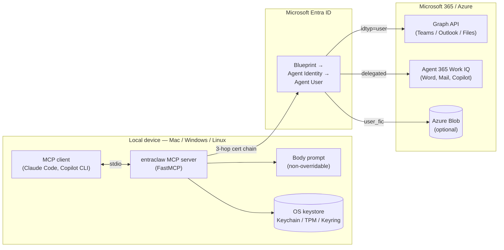

# Entraclaw: Identity Research for Microsoft 365 Agents


Entraclaw is a Python MCP server that gives a device-local agent its own Entra **Agent ID** and an **Agent User** that has all the capabilities of a human user in a Microsoft tenant. It can have a Teams presence and be invited to meetings to chat with your colleagues 1:1, a mailbox it can monitor and respond to, create and edit Word documents, make PowerPoint presentations, and allows you to access your CLI. The agent signs in autonomously, sends Teams messages from its own account, and writes audit events against its own object ID. It runs on macOS, Linux, and Windows, and works with Claude Code, Copilot CLI, or any MCP-speaking client.

**All you need to get started is:**

* A Free Microsoft 365 Developer tenant (sign up at <https://aka.ms/m365devprogram>)
* A license that includes Teams and Outlook (E3 or E5 dev tenant licenses work)
* Python 3.12 installed locally

The scripts will take care of the rest: provisioning the Agent Identity Blueprint, Agent Identity, and Agent User in Entra; uploading a self-signed certificate; assigning the license; and configuring the local MCP server.

 **Microsoft Entra Agent ID** and **Microsoft Agent 365** which enables these expereinces went GA on 2026-05-01. entraclaw is the reference implementation that pulls those primitives together on a real device, today.

---

## What this is

A device-local MCP server that turns an LLM agent into a first-class principal in Microsoft Entra. Three things change when you do this:

- **Attribution.** Every action — Teams message sent, file read, email drafted — is signed by the agent, not by the human who launched it. Sign-in logs distinguish them. Audit trails are honest.
- **Authorization.** Conditional Access, ID Protection, and DLP apply to the agent's own object. You can restrict what the agent can do without restricting yourself.
- **Autonomy.** No device-code prompt, no OBO, no human in the loop on every token refresh. The agent authenticates with its own certificate-backed credentials and minds its own session.

It is for developers building agents on Microsoft 365 who want the security posture to match the architecture. The agent's smarts are up to you. entraclaw gives it a secure seat at the table and the keys to the kingdom; what it does with that power is your call.

The body prompt (`prompts/agent_system.md` plus `prompts/anatomy/*.md`) is non-overridable and loads before any user turn. Security rules, channel discipline, and instruction-injection defense are baked in below the persona line. An agent that runs on entraclaw cannot be jailbroken into impersonating its operator.

---

## The stack

entraclaw is the device-side glue for a set of platform primitives Microsoft shipped at GA.

- **Entra Agent ID** — the four-object hierarchy: Agent Identity Blueprint → BlueprintPrincipal → Agent Identity → Agent User. Confidential clients only; no public-client flows; tokens carry `idtyp=user` for the Agent User leaf. ([platform learning](docs/platform-learnings/agent-id-blueprints-and-users.md))
- **Microsoft Agent 365** — the control plane: admin-center inventory, OTel observability, Work IQ MCP servers (Mail, Calendar, Teams, SharePoint, OneDrive, Word, User, Copilot, Dataverse), AI-teammate lifecycle. GA 2026-05-01. ([platform learning](docs/platform-learnings/microsoft-agent-365.md))
- **Conditional Access for agents** — GA. Apply CA policies to Agent Identity sign-ins the same way you apply them to users.
- **ID Protection for agents** — GA. Risk scoring and remediation against the agent's own object.
- **FastMCP** — the Python MCP server framework. entraclaw registers every Teams, Outlook, Files, Word, audit, and identity tool through it.
- **Three-hop certificate chain** — Blueprint token (cert JWT) → Agent Identity token (federated identity credential) → Agent User token (`user_fic` grant). No client secret in flight. Private key in macOS Keychain, Windows TPM via CNG, or Linux Secret Service.

entraclaw connects these. The Blueprint is provisioned via Graph. The Agent User is licensed and visible in Teams. The MCP server runs locally, mints tokens against Entra without a human, and exposes the resulting capability surface to the agent.

---

## Architecture



The agent talks to the MCP server over stdio. The server reads the Blueprint's private key from the OS keystore, walks the three-hop chain to produce a delegated user token, and uses that token for every Graph and Work IQ call.

**Inbound delivery differs by host.** On **Claude Code**, the server's background poll pushes every inbound Teams message and email directly into the LLM as a `notifications/claude/channel` system reminder — the agent sees a DM the moment it lands, with no tool call and no human prompt required. The conversation in Teams becomes the conversation with the agent. On **Copilot CLI, Codex, Cursor, and any MCP host that doesn't implement the channel-push extension**, the same background poll runs server-side, but messages accumulate in the interaction log instead of streaming in. The agent reads them on demand via `read_teams_messages`, `send_teams_message` auto-blocks for the sponsor's reply when push is unavailable, and `scripts/catch_up.py` prints recent activity from the CLI. Channel push is the better UX; the polling fallback is a working second-class path for hosts that haven't shipped the extension yet.

Operational state (interaction log, daily summaries, watched chats) lives locally by default, or in Azure Blob Storage scoped to the Agent User's object ID when cloud memory is enabled.

Full walkthrough in [`docs/architecture/system-overview.md`](docs/architecture/system-overview.md). The module-by-module breakdown lives in [`docs/architecture/layers/`](docs/architecture/layers).

---

## Quickstart

Mac or Linux:

```bash
git clone https://github.com/brandwe/entraclaw-identity-research.git
cd entraclaw-identity-research
./scripts/setup.sh --new --with-upn-suffix=yourname
source .venv/bin/activate
claude --dangerously-load-development-channels server:entraclaw
```

`setup.sh` is idempotent. It provisions the Blueprint, BlueprintPrincipal, Agent Identity, and Agent User; assigns a Teams-capable license; uploads a self-signed certificate to Entra; and writes `.env` plus `.mcp.json` with no secrets on disk. Full walkthrough — including Windows, cloud memory, cross-tenant group chats, and the Work IQ Word setup — is in [`docs/getting-started/quickstart.md`](docs/getting-started/quickstart.md) and [`INSTALL.md`](INSTALL.md).

---

## Documentation

The full doc site: **<https://brandonwerner.com/entraclaw-identity-research/>**

Direct pointers:

- [Quickstart](docs/getting-started/quickstart.md) — five minutes from clone to first Teams message
- [MCP tool reference](docs/reference/mcp-tools.md) — every tool, every parameter
- [Setup script reference](docs/reference/setup-script.md) — every `setup.sh` flag
- [Token flows](docs/reference/token-flows.md) — the three hops, annotated
- [System overview](docs/architecture/system-overview.md) — how the modules fit together
- [Architecture decisions](docs/decisions/README.md) — ADRs 001–005
- [Platform learnings](docs/platform-learnings/) — Entra Agent ID constraints, Agent 365, MSAL, OS-specific notes
- [Hard-won learnings](docs/runbooks/hard-won-learnings.md) — 60 non-obvious gotchas; read before changing auth or Teams code
- [Engineering status](docs/engineering-status.md) — what's shipped, what's open, what's next

---

## Status

This is a research repo, not a production service. It runs reliably on a developer's machine. It is not packaged for tenant-wide deployment.

**Shipped:**

- Three auth modes: `agent_user` (full three-hop), `delegated` (MSAL interactive for demos without an E5), `bot` (M365 Agents SDK + Bot Framework)
- Teams: 1:1 DMs, group chats, cross-tenant B2B group chats with federated home-tenant resolution
- Outlook: background email poll with Purview-encrypted detection, daily summary at 5pm PT
- Files: SharePoint / OneDrive read, write, upload, share — two-gate sponsor authorization on share
- Microsoft Agent 365 Work IQ Word: create, read, comment, reply-to-comment
- Storage: `LocalBackend` (default) and `BlobBackend` (Azure Blob Storage, opt-in via `setup.sh --use-cloud-memory`)
- Body-first prompt architecture with optional persona layer from a separate MCP (`persona-sati`)
- Audit fails closed: if the audit write fails, the action does not proceed
- 791 tests; `pytest -v && ruff check .` gate every commit

**OS coverage:**

| OS | Status |
|---|---|
| macOS | Shipped — Keychain-backed cert storage, full three-hop flow |
| Linux | Works — Secret Service (libsecret) backend |
| Windows | Shipped, acceptance-tested on ARM64 Windows 11 — TPM-backed CNG cert storage |

**Open:**

- Bot Gateway is functional but not yet live-tested at a real domain
- AppContainer sandbox spike on Windows for stronger process isolation
- A few platform-edge bugs tracked in [`docs/engineering-status.md`](docs/engineering-status.md) (Agent Identity missing `Application.Read.All`; `add_file_comment` Word 404; persona-sati 12h MCP refresh bug paused at the Blueprint public-client constraint)

---

## Contributing

Test discipline is the contract. TDD: failing test first, implementation second. `pytest -v && ruff check .` must pass before every commit; coverage threshold is 80%.

File issues for bugs and platform questions. PRs welcome — for anything touching auth, Teams, or the body prompt, read [`docs/runbooks/hard-won-learnings.md`](docs/runbooks/hard-won-learnings.md) first. The hard-won learnings file is append-only; new gotchas get numbered entries, never deletions.