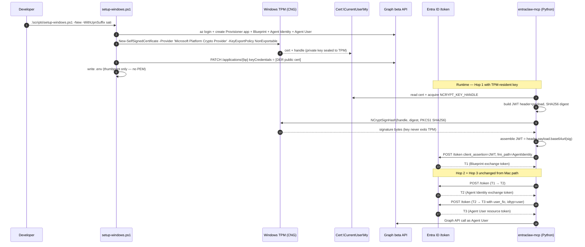

# Windows port: three-hop Agent User provisioning

## Status

**SUPERSEDED 2026-04-28** by [`docs/architecture/PLAN-windows-port.md`](./architecture/PLAN-windows-port.md).
Kept for the TPM/CNG signer design notes (which were adopted, with a software-KSP fallback added).

Proposed — 2026-04-24, author: Claude (PM: Brandon).

## Problem statement

Today the three-hop flow runs end-to-end on macOS only. The Mac path leans on `bash`, Homebrew `openssl` (transitively, via `cryptography`), and the macOS Keychain accessed through Python `keyring`. Brandon wants the same one-command UX on Windows: `scripts/setup-windows.ps1` provisions a fresh device; `scripts/deploy-windows.ps1` re-mints the cert and refreshes registration without rebuilding the Blueprint or Agent User. The interesting design call is *where the private key lives* — the Mac path picked Keychain because it was the smallest viable step; Windows has a strictly stronger primitive (TPM-backed CNG) that is one PowerShell line away, but it requires a non-trivial change to how Hop 1's JWT assertion gets signed (`src/entraclaw/auth/certificate.py:48` loads PEM bytes; CNG won't hand those over). This doc resolves that and the six other surface decisions, then sketches the two scripts and the `windows.py` rewrite.

## Mac path inventory

What `scripts/setup.sh` actually does, mapped to the file that does it:

- **Step 1 — prereqs.** `command -v az`, `command -v python3.12+`, `command -v git` (`scripts/setup.sh:163-198`). Bash-only; trivial to port.
- **Step 2 — `az login` + signed-in user resolution.** `az account show`, `az ad signed-in-user show` (`setup.sh:200-322`). Cross-platform — `az` returns the same JSON on PowerShell. The bash `IFS=','` parsing of `--teams-user` and the OpenID-discovery `curl | python3 -c` for guest tenant lookup (`setup.sh:265-291`) need rewriting in PowerShell, but the Graph queries underneath are the same.
- **Step 3 — bootstrap deps.** `pip install azure-identity requests` into the venv (`setup.sh:324-339`). Direct port.
- **Step 4 — Provisioner app.** `python scripts/entra_provisioning.py` (`setup.sh:454-462`). The Python script is portable; one `subprocess.run(["az", ...])` call at `entra_provisioning.py:274` works identically on Windows.
- **Step 5 — Blueprint + Agent Identity + Agent User.** `python scripts/create_entra_agent_ids.py` (`setup.sh:466-490`). Portable — no shell-isms in the 1061-line script (verified with `grep`; only `subprocess.run`, `requests`, `pathlib`).
- **Step 6 — Cert generation + upload + private-key persist.** Inline Python in setup.sh (`setup.sh:494-669`). This is the load-bearing decision point. Today: `cryptography` generates RSA-2048 in process memory; PEM is written to Keychain via `keyring.set_password("entraclaw", "blueprint-private-key", pem_key)`; DER is uploaded via Graph PATCH `/applications/{id}` with `keyCredentials`. The only Mac-specific bit is *where the key sits* — generation and upload are portable.
- **Step 7 — venv + .env.** `python -m venv .venv`, `source .venv/bin/activate`, `pip install -e ".[dev]"`, write `.env` with `chmod 600` (`setup.sh:671-715`). PowerShell needs `.\.venv\Scripts\Activate.ps1` and ACL tightening instead of `chmod 600`.
- **Step 7b — Blob storage.** `python scripts/provision_blob_storage.py --tenant-id ... --agent-user-object-id ...` (`setup.sh:717-835`). Portable — Python script only shells out via `subprocess.run(["az", ...])` at `provision_blob_storage.py:54`. The bash-side migration prompt and the multi-line heredoc `python -c` invocations need PowerShell equivalents.
- **Step 8 — MCP config + summary.** `python scripts/mcp_config.py --binary $PROJECT_ROOT/.venv/bin/entraclaw-mcp ...` (`setup.sh:885-890`). Portable — but the `--binary` path is `.venv\Scripts\entraclaw-mcp.exe` on Windows.

The runtime touchpoint is `src/entraclaw/tools/teams.py:104` — `store.retrieve("entraclaw", "blueprint-private-key")` returns a PEM string that `build_client_assertion` (`src/entraclaw/auth/certificate.py:48`) feeds to `load_pem_private_key`. **Anything we do for Windows must keep this contract or replace it cleanly** — the call site is the canonical seam.

## Windows-equivalent decisions

### 1. Keystore — recommended: TPM-backed CNG via `Cert:\CurrentUser\My`. Alternative considered: Credential Manager via `keyring`.

Recommendation: generate the cert with `New-SelfSignedCertificate -Provider 'Microsoft Platform Crypto Provider' -KeyExportPolicy NonExportable -CertStoreLocation Cert:\CurrentUser\My`. Private key never leaves the TPM; only a key handle is exposed.

Why not the lazy port (Credential Manager via `keyring`): it works, but it's strictly worse than the Mac baseline. macOS Keychain on Apple Silicon backs into the Secure Enclave; the equivalent move on Windows is TPM, not Credential Manager. Credential Manager is DPAPI-backed, current-user scope, and additionally has a hard `CRED_MAX_CREDENTIAL_BLOB_SIZE = 2560 bytes` ceiling (per the [`CREDENTIALW`](https://learn.microsoft.com/windows/win32/api/wincred/ns-wincred-credentialw) struct). RSA-2048 PKCS#8 PEM (~1700 bytes) fits with ~30% headroom, but RSA-3072+ PEM does not. We are knowingly designing in a future-incompatibility for an algorithmic agility cost we don't need to pay.

The non-trivial cost of CNG: `python-cryptography` (which `auth/certificate.py:48` uses) is OpenSSL-bound and only operates on PEM/DER bytes loaded into process memory. A non-exportable CNG key cannot be handed to it. The Windows Hop 1 signer must instead call `ncrypt.dll` via `ctypes`: `CryptAcquireCertificatePrivateKey(CRYPT_ACQUIRE_ONLY_NCRYPT_KEY_FLAG)` → `NCryptSignHash(NCRYPT_PAD_PKCS1_FLAG, BCRYPT_PKCS1_PADDING_INFO{pszAlgId="SHA256"})` over the JWT signing input (the dot-joined base64url of header and payload). The signer assembles the final JWT and hands it to the existing Hop 1 POST. ~half-day of plumbing, isolated to a new function in `src/entraclaw/auth/certificate_windows.py`. The `build_client_assertion` interface stays unchanged for callers.

Native-Windows feel: 10/10 (one PowerShell line + ctypes shim is the documented pattern). Security: TPM > DPAPI > Cert: store > file. Failure mode: no UAC required for `CurrentUser` scope. PR-attestation capability comes for free if we ever want to assert "this key is in a TPM" to a downstream RP.

### 2. AppContainer / sandbox sequencing — recommended: leave hooks; do not gate v1 on it.

Microsoft published [Sandboxing Python with Win32 app isolation](https://blogs.windows.com/windowsdeveloper/2024/03/06/sandboxing-python-with-win32-app-isolation/) in March 2024, which is the canonical walkthrough for the spike Brandon and a teammatediscussed. Win32 app isolation is AppContainer + MSIX-packaged, with the Application Capability Profiler (ACP) running the app in "learn mode" to enumerate the capability SIDs Python actually needs (file paths, registry keys, named-pipe servers).

For the setup script the deliverable is *not* "ship a sandboxed entraclaw v1." It is: arrange the file system so a future MSIX wrapper can drop in without the install layout fighting it.

- Use `%LOCALAPPDATA%\entraclaw\` for state (writable from inside an AppContainer with the right capability — the historical Windows pattern, and what AppContainer expects).
- Avoid writing to `%PROGRAMFILES%\` or anywhere needing admin elevation. Setup must run as a regular user end-to-end.
- Keep the entraclaw MCP binary path as `.venv\Scripts\entraclaw-mcp.exe`, not a system-wide install. MSIX packaging is a separate downstream step.
- Surface this as **OPEN QUESTION 2** below — owner: Brandon, with proposed default = "ship without sandboxing in v1, leave the layout AppContainer-ready."

### 3. `az` CLI parity — recommended: assume parity, hard-fail on the two known divergences.

`az account show`, `az ad app create`, `az ad sp create-for-rbac`, `az ad signed-in-user show`, `az role assignment create`, `az storage account create` — all return identical JSON on PowerShell vs bash; the CLI is a Python entry point and the wire format is the same. Two real divergences to handle:

- **Path quoting.** Bash heredocs and `$(...)` capture become `@'...'@` here-strings and `$(...)` in PowerShell with different quoting rules. The thumbprint-capture corruption documented in Learning #29 (`docs/runbooks/hard-won-learnings.md:266-272`) — diagnostic stdout leaking into a `$(...)` capture — has the exact same shape on PowerShell. The fix is the same: redirect diagnostic output to stderr at the Python boundary; shape-validate captured values. Apply the same `^[A-Za-z0-9_-]{43}$` regex check before writing `.env`.
- **Output parsing.** Bash uses `--query "..." -o tsv`; PowerShell can use either `-o tsv` or `-o json | ConvertFrom-Json`. Recommendation: `ConvertFrom-Json` everywhere — TSV can be corrupted by warning lines printed by `az` (the explicit guidance in CLAUDE.md non-negotiables). PowerShell makes JSON-to-object conversion cheap; lean on it.

### 4. Cert generation — recommended: `New-SelfSignedCertificate`, never ship `openssl`.

`New-SelfSignedCertificate` is in-box on Windows 10/11. Mandating Homebrew/`choco` `openssl` would be a 10/10 anti-Windows-feel call. The cert lifecycle:

1. Generate in `Cert:\CurrentUser\My` with `Microsoft Platform Crypto Provider`, non-exportable.
2. Read the public DER via `(Get-Item Cert:\CurrentUser\My\$thumbprint).RawData` (this is just the public cert; private key stays in TPM).
3. Compute `x5t#S256` thumbprint as base64url(SHA256(DER)) — same algorithm as `compute_cert_thumbprint` in `auth/certificate.py:72-87`. PowerShell can do this inline or call into the venv's Python — recommend Python for one source of truth.
4. PATCH `/applications/{blueprint-object-id}` with `keyCredentials`, replacing the list (same Graph semantics as `setup.sh:631-642`). Use the Provisioner token, not the `az` CLI token (Learning #1 — applies identically on Windows).

Result: the cert thumbprint round-trips to Entra and the local Cert: store, with no shared file artifact.

### 5. Python venv — recommended: `python -m venv .venv` + `.venv\Scripts\Activate.ps1`. ExecutionPolicy is the only gotcha.

Stock pattern. The script must check `Get-ExecutionPolicy -Scope CurrentUser`; if it's `Restricted`, either fail with a clear message ("run `Set-ExecutionPolicy -Scope CurrentUser RemoteSigned`") or invoke the activate script via `& .\.venv\Scripts\Activate.ps1` after temporarily relaxing for the process scope (`Set-ExecutionPolicy -Scope Process Bypass`). Recommendation: process-scope Bypass with a comment explaining why; never touch CurrentUser policy from setup.

### 6. Path conventions — recommended: `%LOCALAPPDATA%\entraclaw\`. Keep `~/.entraclaw/` as a fallback during migration.

Today every reader uses `Path.home() / ".entraclaw" / subdir` (`src/entraclaw/config.py:36`). Six call sites total: `config.py`, `bot/handler.py:20`, `bot/convo_store.py:17`, `bot/server.py:5-6`, `tools/audit.py:5`, `mcp_server.py:2607`. None of them are publicly documented as user-facing.

Pick `%LOCALAPPDATA%\entraclaw\` because:

- AppContainer-friendly without extra capability declarations (decision 2).
- The Windows-idiomatic location for per-user app state.
- `~/.entraclaw/` on Windows resolves to `C:\Users\<name>\.entraclaw\` — works, but uses a dot-prefix convention nobody else on Windows uses.

Cleanest implementation: change `_default_dir` in `config.py` to consult `platform.system()` and `os.environ.get("LOCALAPPDATA")` on Windows, falling back to `Path.home() / ".entraclaw"` everywhere else. One change, all six call sites pick it up. Add a one-time migration pass: if `~\.entraclaw\` exists *and* `%LOCALAPPDATA%\entraclaw\` does not, rename. Single warning printed on first run; idempotent on re-run.

### 7. Token storage — already DPAPI on Windows; no change needed.

`auth/delegated.py:35` uses `msal_extensions.build_encrypted_persistence(CACHE_LOCATION)`, which on Windows automatically uses DPAPI under the current user. The MSAL token cache is fine as-is; persona-sati's tokens go through the same path. The Blueprint cert private key is in TPM (decision 1) and is the only sensitive material that previously lived in `keyring` — by moving it to TPM we strictly improve the situation.

## setup-windows.ps1 skeleton

```powershell
#Requires -Version 5.1
[CmdletBinding()]
param(
    [switch]$New,
    [string]$UseBlueprint,
    [string]$WithUpnSuffix,
    [string]$TeamsUser,
    [switch]$CloudMemory,
    [switch]$SwitchUser
)

$ErrorActionPreference = 'Stop'
Set-StrictMode -Version Latest
# Process-scope bypass so .venv\Scripts\Activate.ps1 runs without touching user policy
Set-ExecutionPolicy -Scope Process Bypass -Force

$ProjectRoot = (Resolve-Path "$PSScriptRoot\..").Path
Set-Location $ProjectRoot

function Step($n, $msg) { Write-Host "`n[$n/8] $msg" -ForegroundColor Blue }
function Ok($msg)       { Write-Host "  OK  $msg" -ForegroundColor Green }
function Warn($msg)     { Write-Host "  WARN $msg" -ForegroundColor Yellow }
function Die($msg)      { Write-Host "  ERR $msg" -ForegroundColor Red; exit 1 }

# Step 1: prerequisites — az, python 3.12+, git, TPM presence check
Step 1 'Verifying prerequisites'
foreach ($cmd in 'az','python','git') {
    if (-not (Get-Command $cmd -ErrorAction SilentlyContinue)) { Die "$cmd not found" }
}
$pyVersion = (& python -c 'import sys; print(f"{sys.version_info.major}.{sys.version_info.minor}")').Trim()
if ([version]$pyVersion -lt [version]'3.12') { Die "Python >=3.12 required (have $pyVersion)" }
# TPM check — soft-warn so devs without TPM 2.0 can fall back to software-key + Cert: store
$tpm = Get-Tpm -ErrorAction SilentlyContinue
if (-not $tpm -or -not $tpm.TpmReady) { Warn 'TPM not ready — will use software-backed key in Cert:\CurrentUser\My (still better than file)' }

# Step 2: az login + signed-in user resolution
Step 2 'Verifying Azure login'
if ($SwitchUser) { az login | Out-Null }
$account = az account show --output json | ConvertFrom-Json
if (-not $account) { Die 'az login required' }
$tenantId = $account.tenantId
$humanUserId = az ad signed-in-user show --query id -o tsv
# (Teams-user resolution — same Graph queries as bash, port the guest #EXT# detection inline)

# Step 3-5: portable Python provisioning
Step 3 'Bootstrapping provisioning deps'
& python -m pip install --quiet azure-identity requests

Step 4 'Bootstrapping provisioner app'
& python "$ProjectRoot\scripts\entra_provisioning.py"

Step 5 'Creating Blueprint + Agent Identity + Agent User'
if ($New) { $env:ENTRACLAW_NEW_CHAIN = '1'; $env:_ENTRACLAW_UPN_SUFFIX = $WithUpnSuffix }
& python "$ProjectRoot\scripts\create_entra_agent_ids.py"
$state = Get-Content "$ProjectRoot\.entraclaw-state.json" | ConvertFrom-Json
$blueprintAppId = $state.BLUEPRINT_APP_ID
$blueprintObjectId = $state.BLUEPRINT_OBJECT_ID
$agentUserId = $state.AGENT_USER_ID

# Step 6: TPM-backed cert in Cert:\CurrentUser\My + upload public key to Blueprint
Step 6 'Generating TPM-backed Blueprint certificate'
$certParams = @{
    Type             = 'Custom'
    Provider         = 'Microsoft Platform Crypto Provider'   # TPM CNG KSP
    Subject          = "CN=entraclaw-blueprint-$blueprintAppId"
    KeyExportPolicy  = 'NonExportable'
    KeyUsage         = 'DigitalSignature'
    KeyAlgorithm     = 'RSA'
    KeyLength        = 2048
    HashAlgorithm    = 'SHA256'
    CertStoreLocation = 'Cert:\CurrentUser\My'
    NotAfter         = (Get-Date).AddDays(365)
}
$cert = New-SelfSignedCertificate @certParams
# Compute x5t#S256, upload DER via Graph (using the Provisioner token, not az CLI — Learning #1)
& python "$ProjectRoot\scripts\upload_blueprint_cert.py" --thumbprint $cert.Thumbprint --blueprint-object-id $blueprintObjectId
# Defense-in-depth: validate the thumbprint shape before writing state (Learning #29)

# Step 7: venv + .env (use %LOCALAPPDATA%\entraclaw\ via config.py change)
Step 7 'Setting up venv and writing .env'
if (-not (Test-Path "$ProjectRoot\.venv")) { & python -m venv .venv }
& "$ProjectRoot\.venv\Scripts\Activate.ps1"
& pip install --quiet -e ".[dev]"
# Write .env with all ENTRACLAW_* values; lock ACL to current user only (DPAPI-equivalent for files)
$envContent = @"
ENTRACLAW_TENANT_ID=$tenantId
ENTRACLAW_BLUEPRINT_APP_ID=$blueprintAppId
ENTRACLAW_BLUEPRINT_OBJECT_ID=$blueprintObjectId
ENTRACLAW_BLUEPRINT_CERT_THUMBPRINT=$($cert.Thumbprint)
# ... etc
"@
$envContent | Set-Content "$ProjectRoot\.env" -Encoding utf8
icacls "$ProjectRoot\.env" /inheritance:r /grant:r "$($env:USERNAME):(R,W)" | Out-Null

# Step 7b: optional blob storage (delegate to Python — already portable)
if ($CloudMemory) {
    Step '7b' 'Provisioning Azure Blob Storage'
    & python "$ProjectRoot\scripts\provision_blob_storage.py" --tenant-id $tenantId --agent-user-object-id $agentUserId
}

# Step 8: MCP config (write .mcp.json + %USERPROFILE%\.copilot\mcp-config.json)
Step 8 'Writing MCP server config'
& python "$ProjectRoot\scripts\mcp_config.py" `
    --binary "$ProjectRoot\.venv\Scripts\entraclaw-mcp.exe" `
    --project-root $ProjectRoot
Ok 'Setup complete. Restart Claude Code / Copilot CLI in this project.'
```

## deploy-windows.ps1 skeleton

`deploy` is the sub-task of `setup` that runs *after* the Blueprint and Agent User exist. It rotates this machine's cert and refreshes the runtime registration without recreating the identity chain. Useful when (a) the cert is approaching its 365-day expiry, (b) the Blueprint was rotated by a teammate and we lost our key slot, or (c) the user re-runs after a Windows reinstall.

```powershell
[CmdletBinding()]
param([switch]$Force)

$ErrorActionPreference = 'Stop'
$ProjectRoot = (Resolve-Path "$PSScriptRoot\..").Path
$state = Get-Content "$ProjectRoot\.entraclaw-state.json" | ConvertFrom-Json
$blueprintObjectId = $state.BLUEPRINT_OBJECT_ID
if (-not $blueprintObjectId) { Die 'No Blueprint found — run setup-windows.ps1 first' }

# 1. Verify the Agent User and Blueprint still exist (don't re-create — fail loudly)
& python "$ProjectRoot\scripts\verify_blueprint_cert.py" $blueprintObjectId $state.BLUEPRINT_CERT_THUMBPRINT
if ($LASTEXITCODE -eq 0 -and -not $Force) { Ok 'Cert still valid; nothing to do (--Force to rotate anyway)'; exit 0 }

# 2. Generate a NEW TPM cert (keeping the old one in Cert: store until rotation completes)
$newCert = New-SelfSignedCertificate -Subject "CN=entraclaw-blueprint-$($state.BLUEPRINT_APP_ID)" `
    -Provider 'Microsoft Platform Crypto Provider' -KeyExportPolicy NonExportable `
    -KeyAlgorithm RSA -KeyLength 2048 -HashAlgorithm SHA256 `
    -CertStoreLocation Cert:\CurrentUser\My -NotAfter (Get-Date).AddDays(365)

# 3. Upload new cert (Graph PATCH replaces the keyCredentials list — same as setup; warn if other certs exist)
& python "$ProjectRoot\scripts\upload_blueprint_cert.py" --thumbprint $newCert.Thumbprint --blueprint-object-id $blueprintObjectId

# 4. Update .env in place (just the thumbprint line)
(Get-Content "$ProjectRoot\.env") `
    -replace '^ENTRACLAW_BLUEPRINT_CERT_THUMBPRINT=.*$', "ENTRACLAW_BLUEPRINT_CERT_THUMBPRINT=$($newCert.Thumbprint)" `
    | Set-Content "$ProjectRoot\.env"

# 5. Smoke-test: try Hop 1 with the new cert before we delete the old key
& "$ProjectRoot\.venv\Scripts\python.exe" -m entraclaw.tools.teams --smoke-test
if ($LASTEXITCODE -ne 0) { Die 'Smoke test failed — old cert kept; investigate before re-running' }

# 6. Delete the old cert from Cert:\CurrentUser\My (TPM key slot is reclaimed)
$oldThumb = $state.BLUEPRINT_CERT_THUMBPRINT
if ($oldThumb -and $oldThumb -ne $newCert.Thumbprint) {
    Remove-Item "Cert:\CurrentUser\My\$oldThumb" -Force
}

# 7. Refresh MCP config in case the binary path moved
& python "$ProjectRoot\scripts\mcp_config.py" --binary "$ProjectRoot\.venv\Scripts\entraclaw-mcp.exe" --project-root $ProjectRoot
Ok 'Deploy complete. Old cert revoked.'
```

`deploy` is intentionally narrow: it never touches the Blueprint app, the Agent Identity, the Agent User, or the storage container. If those need to change, run `setup-windows.ps1`.

## CredentialStore Windows implementation plan

Today `src/entraclaw/platform/windows.py` is a copy-paste of `mac.py` against `keyring` — fine if the key were a software-backed PEM, useless if the key is TPM-resident. Rewrite:

```python
# src/entraclaw/platform/windows.py
"""Windows credential store backed by CNG (TPM when available) + DPAPI fallback.

The Blueprint's private key is stored as a non-exportable CNG key in
Cert:\\CurrentUser\\My. ``store()`` for service='entraclaw',
key='blueprint-private-key' is a no-op — generation happens in
setup-windows.ps1 and the key never leaves the TPM. ``retrieve()`` for
that key returns a sentinel object that the JWT signer recognizes and
hands off to the CNG signing path.

All other (service, key) tuples — refresh tokens, token cache pieces,
non-cert secrets — round-trip through Credential Manager via ``keyring``
exactly as today.
"""

class CngKeyHandle:
    """Sentinel returned by retrieve() for the Blueprint private key.

    Wraps the cert thumbprint; the JWT signer uses it to call
    NCryptOpenKey + NCryptSignHash via ctypes.
    """
    def __init__(self, thumbprint: str): self.thumbprint = thumbprint

class WindowsCredentialStore:
    BLUEPRINT_KEY_NAMES = frozenset({"blueprint-private-key"})

    def store(self, service, key, value):
        if (service, key) == ("entraclaw", "blueprint-private-key"):
            # No-op — TPM keys are created by New-SelfSignedCertificate, not stored from Python
            return
        keyring.set_password(service, key, value)

    def retrieve(self, service, key):
        if (service, key) == ("entraclaw", "blueprint-private-key"):
            # Read thumbprint from .env; return a handle, not bytes
            thumb = os.environ.get("ENTRACLAW_BLUEPRINT_CERT_THUMBPRINT")
            return CngKeyHandle(thumb) if thumb else None
        return keyring.get_password(service, key)

    def delete(self, service, key):
        if (service, key) == ("entraclaw", "blueprint-private-key"):
            # Delegated to PowerShell deploy script (Remove-Item Cert:\)
            return
        with contextlib.suppress(keyring.errors.PasswordDeleteError):
            keyring.delete_password(service, key)
```

Then in `auth/certificate.py`, `build_client_assertion` learns to recognize the sentinel:

```python
def build_client_assertion(*, private_key_pem, cert_thumbprint, client_id, token_endpoint):
    if isinstance(private_key_pem, CngKeyHandle):
        return _build_assertion_cng(private_key_pem, cert_thumbprint, client_id, token_endpoint)
    # existing PEM path unchanged
    ...
```

`_build_assertion_cng` lives in a new `auth/certificate_windows.py` (only imported on Windows). It builds the unsigned JWT (header + payload, base64url-joined), then calls into `ctypes.windll.ncrypt`:

- `NCryptOpenStorageProvider` → `MS_PLATFORM_CRYPTO_PROVIDER` handle.
- `CryptAcquireCertificatePrivateKey(cert_context, CRYPT_ACQUIRE_ONLY_NCRYPT_KEY_FLAG)` → `NCRYPT_KEY_HANDLE`.
- `NCryptSignHash(key, BCRYPT_PKCS1_PADDING_INFO{pszAlgId="SHA256"}, sha256_digest, ..., NCRYPT_PAD_PKCS1_FLAG)` → signature bytes.
- Append `base64url(sig)` to the JWT and return the assembled string.

Error cases to handle: `NTE_BAD_KEYSET` (key was deleted out-of-band — surface as `AgentIDNotAvailable` with "rerun deploy-windows.ps1"); `NTE_BAD_HASH_STATE` (TPM contention — retry once with 100ms backoff, then fail); `NTE_NO_MEMORY` (TPM key slot full — surface with cleanup instructions). All errors must include the cert thumbprint in the message — without it, debugging which TPM key is broken is brutal.

Tests: mock `ctypes.windll.ncrypt` for unit tests; integration tests gated by `pytest.mark.windows_tpm` skip on non-Windows hosts. Round-trip test: generate a software-backed cert in `Cert:\CurrentUser\My` (no `Microsoft Platform Crypto Provider`), sign a JWT, verify the signature via `cryptography` against the public cert — proves the path before TPM enters the picture.

## Sequence diagram



## Open questions for Brandon

1. **TPM-required vs TPM-preferred?** Default: TPM-preferred — fall back to `Cert:\CurrentUser\My` software-backed key if `Get-Tpm` reports `TpmReady=False`. Hardline TPM-required closes the door on dev VMs and older hardware. Recommended default if no answer: **TPM-preferred with a `WARN` line in setup so the security posture is visible to the user**.
2. **AppContainer in v1?** Default: no — leave the file layout sandbox-ready (`%LOCALAPPDATA%`, no admin elevation), ship the Win32-app-isolation spike as a follow-on per `docs/engineering-status.md:319`. Recommended default: **defer**.
3. **Where does the "Windows path" docs live?** Default: a new `docs/runbooks/windows-setup.md` cross-linked from `docs/engineering-status.md` and the Read-These-First section in CLAUDE.md. Recommended default: **add the runbook in the same PR as the scripts**.
4. **Do we ship a `setup_delegated.ps1` too?** The Mac repo has `scripts/setup_delegated.sh` for the lighter MSAL-only mode (`docs/engineering-status.md:241`). Default: yes, but not in the same PR — token cache via `msal-extensions` already handles DPAPI; the bash port is mechanical. Recommended default: **stage as PR-2**.
5. **MSIX packaging in scope?** Default: no — that's the AppContainer spike's deliverable. Recommended default: **out of scope here**.
6. **`pywin32` as a hard dep?** The CNG signer can be done with `ctypes` alone (zero new deps) or with `pywin32` (cleaner, +14 MB wheel). Recommended default: **`ctypes`-only — keep the Python install footprint identical to Mac**.

## Risks and rollback

- **Mixed-platform `.entraclaw` directory.** A user who runs `setup.sh` on Mac then `setup-windows.ps1` on the same Dropbox-synced repo (or the same WSL share) will end up with state in two places. Mitigation: the migration helper reads from both `~/.entraclaw/` and `%LOCALAPPDATA%\entraclaw\`, prefers the newer one, and prints both paths on first divergence. Don't auto-merge — the data shapes match but the cert thumbprints don't, and silently picking one would soft-brick Hop 1.
- **TPM key slot exhaustion.** TPMs have ~25-30 key slots. Repeated `setup-windows.ps1 -New` with bad cleanup will fill it. Mitigation: `setup-windows.ps1 -New` enumerates `Cert:\CurrentUser\My\*` for the same `CN=entraclaw-blueprint-*` subject and offers to `Remove-Item` stale entries before the new generation. The deploy script already handles the rotation case cleanly.
- **Blueprint cert replacement on Entra is a list-replace, not append.** Same risk as Mac (`setup.sh:534-564`) — `keyCredentials` PATCH wipes other devs' certs from the same Blueprint. Mitigation: same warning flow, ported. Worth re-emphasizing because Windows admins may have stronger expectations of additive operations than bash users.
- **Cert: store leak across user accounts.** `Cert:\CurrentUser\My` is per-user, not per-process, and not per-AppContainer. If a future MSIX package runs in a different identity (LocalService, etc.) the cert won't be visible. Acknowledge in the AppContainer spike's design.
- **Rollback plan.** `setup-windows.ps1 -Rollback` (not in v1, but trivial to add): `Remove-Item Cert:\CurrentUser\My\$thumb`, delete `.entraclaw-state.json`, delete `%LOCALAPPDATA%\entraclaw\`, leave Entra-side identities untouched (use `scripts/cleanup-orphans.sh`'s logic via Python — already portable). The Entra-side cleanup remains a Python script invocation, same as Mac.
- **What if a developer runs setup.sh then setup-windows.ps1 on the same `.entraclaw` dir later?** State file is shared. The Windows script would see `BLUEPRINT_OBJECT_ID` already set, attempt to verify the Mac cert thumbprint (fails — Mac cert isn't in TPM), trigger the regeneration path, replace the Blueprint's `keyCredentials` list, and effectively kick the Mac off. This is the correct behavior per the existing Mac-side warning (`setup.sh:548-563`) but the cross-platform case must be called out in the warning text. Add: "If you set this Blueprint up on Mac and are now on Windows, the Mac install will stop working until you re-run `setup.sh` there." Same model as switching machines.

## Sources

- `scripts/setup.sh` (canonical Mac flow — every step mapped above).
- `src/entraclaw/platform/{base,mac,linux,windows,__init__}.py` — current `CredentialStore` shim; Windows is a stub.
- `src/entraclaw/auth/certificate.py:48` — PEM-only signer; the seam that needs a CNG sibling.
- `src/entraclaw/auth/delegated.py:35` — `msal_extensions.build_encrypted_persistence` already DPAPI-backed on Windows.
- `src/entraclaw/tools/teams.py:104` — runtime call site for the private key retrieval.
- `src/entraclaw/config.py:36` — `_default_dir` — the one place to plumb `%LOCALAPPDATA%`.
- `scripts/create_entra_agent_ids.py`, `scripts/provision_blob_storage.py`, `scripts/entra_provisioning.py` — verified portable (only `subprocess.run(["az", ...])` and `requests`).
- `docs/decisions/003-certificate-auth-over-client-secrets.md` — the WHY for cert auth, including the "Windows: TPM 2.0" line that this doc operationalizes.
- `docs/runbooks/hard-won-learnings.md` — Learning #1 (no `az` tokens for Agent Identity APIs), #15 (Graph v1.0 for keyCredentials), #29 (thumbprint capture validation).
- `docs/engineering-status.md:252-253, 318-319` — Windows VM and AppContainer spike entries.
- Microsoft Learn — [`New-SelfSignedCertificate`](https://learn.microsoft.com/powershell/module/pki/new-selfsignedcertificate), [`CREDENTIALW`](https://learn.microsoft.com/windows/win32/api/wincred/ns-wincred-credentialw), [`CryptAcquireCertificatePrivateKey`](https://learn.microsoft.com/windows/win32/api/wincrypt/nf-wincrypt-cryptacquirecertificateprivatekey), [`NCryptSignHash`](https://learn.microsoft.com/windows/win32/api/ncrypt/nf-ncrypt-ncryptsignhash), [How Windows uses the TPM — Platform Crypto Provider](https://learn.microsoft.com/windows/security/hardware-security/tpm/how-windows-uses-the-tpm), [Application isolation](https://learn.microsoft.com/windows/security/book/application-security-application-isolation), [Sandboxing Python with Win32 app isolation (March 2024)](https://blogs.windows.com/windowsdeveloper/2024/03/06/sandboxing-python-with-win32-app-isolation/).
