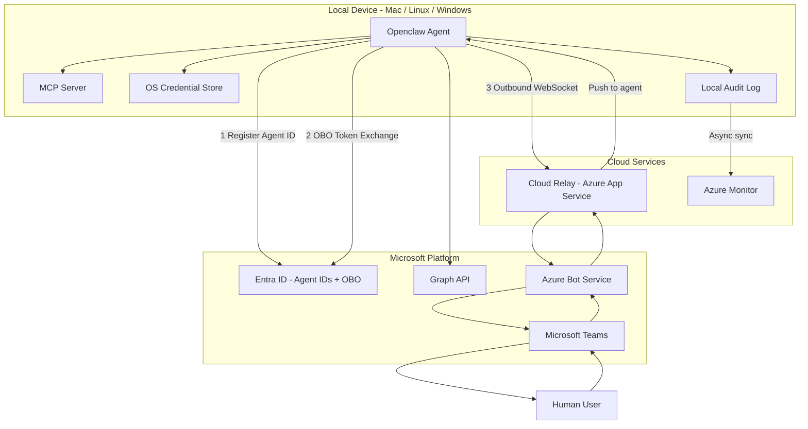
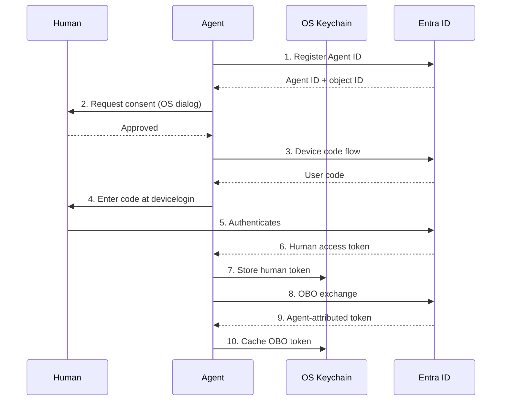
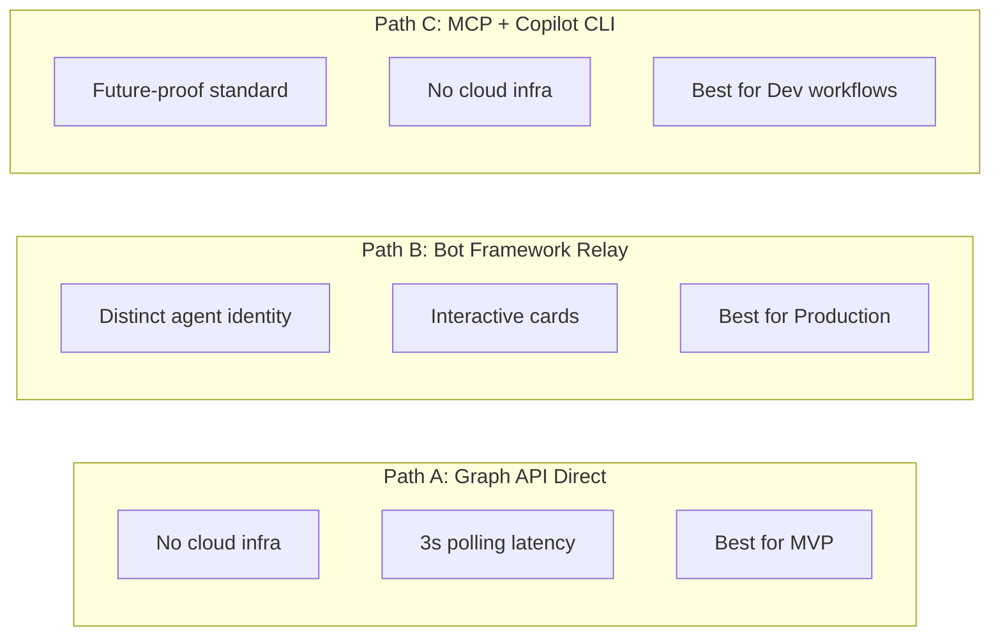
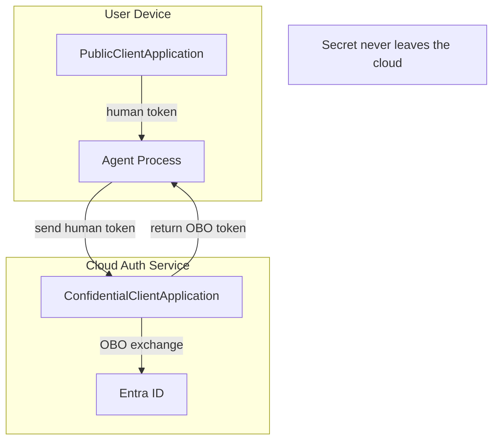

# Openclaw Identity Architecture — Proposals

> How to demonstrate agent identity, OBO token flows, and Teams integration on Mac/Linux/Windows

## Table of Contents

- [The Problem](#the-problem)
- [The Scenario](#the-scenario)
- [Requirements](#requirements)
- [Platform Limitations & Broad Issues](#platform-limitations--broad-issues)
- [Solution Overview](#solution-overview)
- [System Architecture](#system-architecture)
- [The OBO Token Flow](#the-obo-token-flow)
- [Teams Integration: Three Paths](#teams-integration-three-paths)
- [The Split Architecture (Security)](#the-split-architecture)
- [Per-OS Proposals](#per-os-proposals)
  - [macOS: Three Proposals](#macos)
  - [Linux: Three Proposals](#linux)
  - [Windows: Three Proposals](#windows)
- [Cross-Platform Considerations](#cross-platform-considerations)
- [Risk Register](#risk-register)
- [Recommended Phased Approach](#recommended-phased-approach)

---

## The Problem

When an autonomous agent runs on a user's device — writing code, deploying services, accessing files — everything it does looks like the **human** did it. Sign-in logs, access logs, audit trails — all attributed to the user. There is no way to distinguish "the human typed this command" from "an AI agent autonomously decided to do this."

This is a security and governance gap. Enterprises need to know:
- **Who** performed an action — human or agent?
- **What** permissions was the agent using — its own, or delegated by a human?
- **When** did the human consent — and can they revoke it?
- **Where** is the audit trail that proves all of the above?

In the cloud, we solved this with **Agent IDs** and **on-behalf-of (OBO)** token flows. An agent gets its own identity in Microsoft Entra, the human consents, and the resulting OBO token attributes all actions to the agent while preserving the chain back to the consenting human.

**The challenge:** Bring this identity model to agents running on local devices — Mac, Linux, and Windows — and demonstrate bidirectional communication through Microsoft Teams.

---

## The Scenario

A Microsoft employee using our agentic Copilot harness for code:

1. **Creates** an autonomous agent on their Mac, Linux, or Windows machine
2. The agent **gets an Agent ID** — a distinct identity registered in Microsoft Entra
3. The agent **asks the user for permission** to act on their behalf
4. The user **grants permission** through an OS-native consent prompt
5. The agent **performs an OBO token exchange** — getting its own scoped token
6. The agent **uses the token to do work** on the device, with every action tracked
7. **Resource access is audited** — logs show the agent, not the human
8. The agent **connects to Teams** as an "Agent User" for bidirectional communication
9. The human **steers the agent through Teams** — like `gh copilot --remote` but through Teams

---

## Requirements

| # | Requirement | Category |
|---|-------------|----------|
| R1 | Agent obtains a distinct Entra Agent ID, separate from the human | Identity |
| R2 | Human explicitly consents before the agent can act | Consent |
| R3 | Agent acquires OBO token — attributed to agent, delegated from human | Auth |
| R4 | All agent actions emit audit events before execution | Audit |
| R5 | Audit logs distinguish agent actions from human actions | Audit |
| R6 | Agent sends messages to human via Teams | Teams |
| R7 | Human sends commands to agent via Teams | Teams |
| R8 | Works on macOS, Linux, and Windows | Platform |
| R9 | Credentials stored in OS-native secure storage | Security |
| R10 | Human can revoke agent access at any time | Governance |

---

## Platform Limitations & Broad Issues

### Identity Limitations
- **Agent IDs are in public preview** — the beta API may change before GA
- **Agent IDs are single-tenant only** — no cross-tenant, no personal Microsoft accounts
- **No device attestation** — Agent IDs don't bind to hardware (TPM/Secure Enclave). A copied credential works on any machine
- **ConfidentialClient on device is risky** — the agent blueprint secret on a user device is a crown-jewel credential exposed to user-space attack

### Teams API Limitations
- **Chat messages require delegated permissions** — application permissions cannot send chat messages. The agent MUST have a user identity
- **Webhook subscriptions expire every 60 minutes** — renewal failures cause silent message loss
- **No interactive Adaptive Cards via Graph API** — `Action.Submit` buttons only work through Bot Framework
- **Rate limits are aggressive** — ~10 messages/10 seconds per thread, ~3000/day per channel
- **Bot Framework requires a public HTTPS endpoint** — device-local agents are behind NAT

### Cross-Platform Challenges
- **macOS TCC changes every OS release** — Keychain access, automation permissions can break
- **Linux has no standard consent framework** — GNOME vs KDE vs headless all differ
- **Windows Defender may flag the agent** — token acquisition + persistent HTTP calls match infostealer signatures
- **SDK churn is extreme** — Bot Framework deprecated Dec 2025, TeamsFx deprecated Sep 2026, extensions deprecated for MCP

---

## Solution Overview

Before diving into per-OS proposals, here is every viable approach scored by feasibility:

| OS | Proposal | Teams Path | Cloud Required | Feasibility | Timeline |
|----|----------|------------|---------------|-------------|----------|
| **macOS** | A: Graph-Native Agent User | Graph API + delta polling | No | ✅ High | 5-6 weeks |
| **macOS** | B: XPC-Separated Bot Hybrid | Bot Framework + cloud relay | Yes | ⚠️ Medium | 10-12 weeks |
| **macOS** | C: Keychain-Bridged CLI Extension | MCP via Copilot CLI | No | ⚠️ Medium | 6-8 weeks |
| **Linux** | A: Cloud-Relayed Bot | Bot Framework + cloud relay | Yes | ⚠️ Medium | 10-14 weeks |
| **Linux** | B: Direct Graph, No Bot | Graph API + delta polling | No | ✅ High | 6-8 weeks |
| **Linux** | C: Adaptive Hybrid | M365 Agents SDK + adaptive consent | Yes | ⚠️ Medium | 15-20 weeks |
| **Windows** | 1: WAM-Native Agent | Graph API + WAM SSO | No | ⚠️ Medium | 12-16 weeks |
| **Windows** | 2: Graph-First Lightweight | Graph API + delta polling | No | ✅ High | 6-8 weeks |
| **Windows** | 3: Hybrid Bot Relay | Bot Framework + WebSocket relay | Yes | ⚠️ Medium | 10-14 weeks |

**Key insight:** Every OS has a "fast MVP" proposal (Graph API + polling, no cloud infra, 6-8 weeks) and a "production" proposal (Bot Framework relay, richer UX, 10-14 weeks). **Start with the fast MVP on one OS, then iterate.**

---

## System Architecture

The target architecture that all proposals converge toward:

**[View interactive diagram →](https://mermaid.live/edit#pako:eNp1VE1v2zAM_SuEr1tQbLvtUMBJii1AggR1hh6WHRSJcYTaUqCPpF3d_15Kco2qSXQQRepR5KMovRRcCyx-QrFr9InvmXGwHm8U0LB-Wxt22MMUj5Lj300x15w1vQojWDAONzCXyj-RfJBK6JPdFP-SexhljcqR4_KAijfslAwZZDFZEYBmqNAc0WSbE4PCBv8qLslXUgKV0wbzOF5INyQYNZjr-jwXGI1uQ8hL5hjs0kY8L22gEp-KM2m0FxQ6ysiBipNX4R4b9jxAokbVK_97g1AeDu9OeVm0kkSTvBKu1wfMeSKLKtRRcqOt3jlYNczttGmzU--UM4xgUcJsGtKINGdTC19gOV5m8F_hYIJHCeVqlu2ukbU2ixktGWasXXXkAwtSz9gOTH77limCRgl_7IdeGO6i-0b1q6V1aIbMu0TrM_J7oANr_YgK7p6otVWNV6A_YOndVnsl4AG3leaP6Lp0UQna3xn1QiKUrGkdzYm5GsoSjZHIB27XkVdOvZRBt_J2D04DC-l3_YvKCaWL643xMQTH0j4rDmHq3tup-ApFi6ZlUtAf8FK4PbbxNxC4Y75xxevrG5b5RHc=)**

---

## The OBO Token Flow

This is the core identity operation. The human authenticates once, and the agent exchanges that token for its own:

**[View interactive diagram →](https://mermaid.live/edit#pako:eNptUstOwzAQ_JVVTiCoRXmTQ6VAIwVxiETFjcvW2SaGxg72poCq_jt2QotC64MPnvHM7GjXkTQFRTFEjj5a0pKmCkuL9asGfxq0rKRqUDNkgA6ytka9jyUBS0rSvI_lswD6-4m-ZYXqwPc0MFLNFuFx2sPJaDJJYxgLeKZSOSbb6-8I6cgzknj3Cidg5m8keSCRxXAeJPxsjkEa7QL7yKcpFC5NedxTs61Y01izomKQ4ULAlFZKEoSuYLE0n8MIL86nC9jA91KEkX4RQIaiE_Gm2wqyXv9KQNJy5YMpiUxuKH4t-tIBpSTngM076T-jfBbDjYAZG0tQdcR_DO9wKyC_z4G-fP-6pKHBneg7HCGzVfOWqThkMj4T8ICyok6qI0SnENVka1SF36B15Geou10qaIHtkqPN5gexT7hl)**

**What the OBO token contains:**

| Claim | Value | Meaning |
|-------|-------|---------|
| `sub` / `oid` | Agent's object ID | The **agent** is the principal — not the human |
| `azp` | Agent's client ID | Identifies which app performed the exchange |
| On-behalf-of chain | Human's object ID | Links back to the consenting human |

---

## Teams Integration: Three Paths

**[View interactive diagram →](https://mermaid.live/edit#pako:eNp9ksFqAjEQhl9lyLXtoXrbmxuxCFoWD73UHqbJrIZmk2UyqxTx3ZutWBoPziGE_B_Dx2ROykRLqgLV-ng0e2SB1WYbIFcaPneM_R5m71vVoORLBS-Xl2YJc8dkZKs-LvRYs-dMvkYwPg4WXGgZy3yS82mCPnrvwg48CgXzXTLTzNSUBNrIsH5r_lIK9kasforVFdRRYMHY0THyF2zIY9m3Ht3mLokLRgB3FASczaeTG3CUXAYhRiPuQGCQbSqRwrHhaIeMxnBHVV9VdQVr3cAD6Ng7n6X1alk016PoYpCB6annGFtIgsFmiRKb3J-1LhzndIBxMOMvp_-a6hFUR9yhs3kLTkr21P3ug6UWBy_qfP4BD8mmvw==)**

### Path A: Graph API Direct — No Cloud Infrastructure

| Aspect | Details |
|--------|---------|
| **How it works** | Agent calls `POST /chats/{id}/messages` with OBO token. Polls for replies via delta query every 3 seconds. |
| **Agent identity** | Messages appear as the "Agent User" account — a real Entra user |
| **Pros** | No cloud relay, no Bot Framework, simple REST calls, works from behind any firewall |
| **Cons** | No interactive Adaptive Cards, 3s latency, requires an M365 license for the Agent User, webhook subscriptions expire every 60 min |
| **Best for** | MVP / proof of concept / demo |

### Path B: Bot Framework + Cloud Relay — Production Quality

| Aspect | Details |
|--------|---------|
| **How it works** | Agent connects outbound (WebSocket) to a cloud relay service. Relay hosts the Bot Framework endpoint. Messages flow: Agent ↔ Relay ↔ Azure Bot Service ↔ Teams ↔ Human |
| **Agent identity** | Bot appears as its own distinct entity in Teams — not a human user |
| **Pros** | Real agent identity, interactive Adaptive Cards with buttons, real-time messaging, proactive notifications |
| **Cons** | Requires cloud infrastructure, Bot Framework SDK deprecated (use M365 Agents SDK), conversation reference management |
| **Best for** | Production deployment, enterprise scenarios |

### Path C: MCP Server + Copilot CLI — Developer-First

| Aspect | Details |
|--------|---------|
| **How it works** | Agent exposes itself as an MCP server. Copilot CLI connects as MCP client. Human steers via terminal or `--remote` web UI. Teams is a notification sidecar, not the primary channel. |
| **Agent identity** | Agent maintains its own Agent ID for auth; MCP is the transport layer |
| **Pros** | No cloud infra, future-proof (MCP is the emerging standard), composable with any MCP host |
| **Cons** | No native Teams channel for bidirectional chat, agent becomes "tooling" rather than autonomous, MCP is tool-oriented not agent-oriented |
| **Best for** | Developer workflows, Copilot CLI integration |

---

## The Split Architecture

The devil's advocate analysis surfaced a critical security finding: **don't put ConfidentialClientApplication credentials on user devices.**

**[View interactive diagram →](https://mermaid.live/edit#pako:eNp9UU1PwzAM_StWzuwPcEDqMg5cWKWOE-WQpW4bkSZVPgrSuv-Ok46iDUQusePn5-e8E5O2QXYPrNX2Q_bCBThsawN0fDx2Tow97HBSEl9r9uLRXbKavS2odEpeULWMR60k1wpNKMaRYhGUNVfIoqNi6awkfI4hJej9LR9sNg9zHwdhINh3NPNP64JD09zI5NrGppoSdQ6hiKGHCt0vvTzr5da0qiFSJfT_qvlFz367B_ykXzIdzvBoghPEk2942q0tq7RVcu729A5XKxHvAvwe4DBEZyDN-XvrZxuSERVKgoLBiQzRKCb0EHoEmfYmHewO2IBuEKohb0-MakN2ucFWRB3Y-fwF9oejgQ=)**

**Why this matters:** The blueprint's client secret is a crown-jewel credential. On a user device, any process running as the same user can read it from memory. The split architecture keeps the secret in a hardened cloud service — the device agent only holds a `PublicClientApplication` token and sends it to the cloud for OBO exchange.

**For MVP:** Accept the risk and put `ConfidentialClient` on-device. **For production:** Implement the split architecture.

---

## Per-OS Proposals

### macOS

#### Proposal A: "Graph-Native Agent User" — Pure REST, No Bot Framework ⭐ Recommended for MVP

A single Python process running as a macOS Launch Agent. No cloud relay, no Bot Framework, no public endpoint.

**Architecture:**
- Agent runs as `com.openclaw.agent` via `launchd`
- MSAL `PublicClientApplication` for device code flow → human authentication
- OBO exchange via `ConfidentialClientApplication` for agent-attributed token
- Graph API for Teams: create 1:1 chat, send messages, delta poll for replies (3s interval)
- Keychain via `keyring` library for all credential storage
- macOS `osascript` dialog for consent prompt; falls back to terminal for SSH

**Consent UX:** Native macOS dialog via `osascript` — "Openclaw Agent requests permission to act on your behalf in Microsoft Teams" with Allow/Deny buttons. Looks like a system prompt.

**Credential Storage:** macOS Keychain with `kSecAttrAccessibleWhenUnlockedThisDeviceOnly`. MSAL cache via `msal-extensions` `KeychainPersistence`. ACL bound to the Python interpreter path.

**Key Innovation:** Share tokens with `gh` CLI via Keychain access groups using `security add-generic-password -T /usr/local/bin/gh -T /usr/local/bin/openclaw` — both tools can access the same credentials without prompts.

| Metric | Value |
|--------|-------|
| Feasibility | ✅ High |
| Timeline | 5-6 weeks |
| Cloud infra | None |
| Risk | Delta polling latency; Agent User needs M365 license |

#### Proposal B: "XPC-Separated Bot Framework Hybrid"

Process-isolated architecture using macOS XPC services. The auth component runs as a separate XPC service with its own entitlements, providing defense-in-depth.

**Architecture:**
- Main agent process handles task execution
- `com.openclaw.auth` XPC service handles all MSAL operations — even if the agent is compromised, the auth service has its own process boundary
- Bot Framework (or M365 Agents SDK) via cloud relay for Teams messaging — Adaptive Cards, interactive buttons, real-time
- Audit events written to macOS Unified Logging (`os_log`) + synced to Azure Monitor

**Key Innovation:** XPC process isolation means a compromised agent process cannot directly access the MSAL token cache or blueprint credentials.

| Metric | Value |
|--------|-------|
| Feasibility | ⚠️ Medium |
| Timeline | 10-12 weeks |
| Cloud infra | Azure App Service for relay |
| Risk | XPC complexity; M365 Agents SDK Python maturity |

#### Proposal C: "Keychain-Bridged CLI Extension"

Graft Openclaw identity onto the existing Copilot CLI. The agent is a `gh` extension or MCP server that Copilot CLI connects to. Teams communication happens through the Copilot CLI's session infrastructure.

**Architecture:**
- Agent is an MCP server exposing tools: `agent_execute`, `agent_status`, `agent_consent`
- Copilot CLI connects to the agent and steers it
- Consent prompt delivered via Teams Adaptive Card (sent via Graph API) — human approves from anywhere
- Device code flow completion URL sent via Teams, not displayed in terminal

**Key Innovation:** Consent-via-Teams — instead of requiring the human to be at the Mac, they approve from Teams on any device.

| Metric | Value |
|--------|-------|
| Feasibility | ⚠️ Medium |
| Timeline | 6-8 weeks |
| Cloud infra | None |
| Risk | ACP protocol stability; Copilot CLI coupling |

---

### Linux

#### Proposal A: "Cloud-Relayed Bot" — Full Native Integration

Full systemd + Secret Service + polkit + Bot Framework architecture.

**Architecture:**
- Agent runs as systemd user service with `Restart=on-failure` and security hardening (`ProtectSystem=strict`, `NoNewPrivileges=true`)
- Credentials in GNOME Keyring / KWallet via `secretstorage` library, with fallback to encrypted file for headless
- polkit for consent UX — custom policy with a JavaScript rule that presents an authorization dialog
- Bot Framework cloud relay for Teams (same as macOS Proposal B)
- Audit events written to systemd journal (`journald`) + synced to Azure Monitor

**Consent UX:** polkit authorization dialog on desktop Linux. For headless/SSH: terminal prompt with PAM integration for identity verification.

**Key Innovation:** systemd `PrivateUsers=true` + `ProtectSystem=strict` creates a hardened sandbox that limits agent process capabilities even if compromised.

| Metric | Value |
|--------|-------|
| Feasibility | ⚠️ Medium |
| Timeline | 10-14 weeks |
| Cloud infra | Azure App Service for relay |
| Risk | Desktop environment fragmentation; polkit UX varies by distro |

#### Proposal B: "Direct Graph, No Bot" ⭐ Recommended for MVP

Mirrors macOS Proposal A. Single Python process, systemd user service, Graph API for Teams, delta polling.

**Architecture:**
- systemd user service with `loginctl enable-linger` for persistence across logouts
- MSAL token cache via `msal-extensions` `LibsecretPersistence` (desktop) or `FilePersistenceWithDataProtection` (headless)
- Graph API for Teams messaging + delta polling
- Audit to structured JSON log + journald

**Credential Storage (headless fallback):** When no Secret Service is available, use file-based cache at `~/.openclaw/token_cache.bin` with permissions `600`, encrypted with a key derived from `/etc/machine-id` + user salt.

| Metric | Value |
|--------|-------|
| Feasibility | ✅ High |
| Timeline | 6-8 weeks |
| Cloud infra | None |
| Risk | Secret Service absent on headless; file-based fallback is weaker |

#### Proposal C: "Adaptive Hybrid" — Multi-Tier for All Linux Environments

Detects the Linux environment (desktop with GNOME, desktop with KDE, headless server, WSL2) and adapts consent UX, credential storage, and notification transport accordingly.

**Consent UX tiers:**
1. **Desktop + polkit:** Native authorization dialog
2. **Desktop + no polkit:** `zenity` or `kdialog` popup
3. **Headless + terminal:** Interactive terminal prompt
4. **WSL2:** Windows toast notification via `powershell.exe`

| Metric | Value |
|--------|-------|
| Feasibility | ⚠️ Medium |
| Timeline | 15-20 weeks |
| Cloud infra | Optional relay |
| Risk | Testing matrix explosion; WSL2 interop complexity |

---

### Windows

#### Proposal 1: "WAM-Native Agent" — Deep Platform Integration

Leverages Windows' deep Entra integration: Web Account Manager (WAM) for SSO, DPAPI for secrets, ETW for audit, Windows Hello for biometric consent.

**Architecture:**
- Agent runs as Windows Service under a dedicated service account
- WAM/PRT (Primary Refresh Token) for seamless SSO on Entra-joined devices — no device code flow needed
- DPAPI for credential encryption (user-scope)
- ETW (Event Tracing for Windows) for high-performance audit events
- Windows toast notifications with action buttons for consent UX

**Key Innovation:** On Entra-joined devices, WAM provides silent SSO — the agent inherits the device's PRT and can acquire tokens without any user interaction beyond the initial consent. This is the smoothest UX of any proposal.

| Metric | Value |
|--------|-------|
| Feasibility | ⚠️ Medium |
| Timeline | 12-16 weeks |
| Cloud infra | None |
| Risk | WAM requires Entra-joined device; MSAL Python WAM support is limited |

#### Proposal 2: "Graph-First Lightweight" ⭐ Recommended for MVP

Mirrors macOS/Linux MVP proposals. Task Scheduler for background execution, Credential Manager for storage, Graph API for Teams.

**Architecture:**
- Runs via Task Scheduler (`schtasks`) with "Run whether user is logged on or not"
- Credential Manager via `keyring` library for token storage
- MSAL device code flow for auth, OBO for agent token
- Graph API for Teams + delta polling
- Audit to structured JSON log

| Metric | Value |
|--------|-------|
| Feasibility | ✅ High |
| Timeline | 6-8 weeks |
| Cloud infra | None |
| Risk | Task Scheduler less robust than a service; Credential Manager items visible in Control Panel |

#### Proposal 3: "Hybrid Bot Relay with Device Intelligence"

Production-grade architecture combining Bot Framework relay with Windows-native security features.

**Architecture:**
- Agent runs as Windows Service (pywin32 `ServiceFramework`)
- Cloud relay via persistent WebSocket connection
- Bot Framework / M365 Agents SDK for Teams — Adaptive Cards with interactive buttons
- DPAPI for credential encryption
- ETW for high-performance structured audit events
- Multi-tier consent: (1) Windows toast notification, (2) Teams Adaptive Card, (3) terminal prompt
- Windows Defender exclusion manifest for enterprise deployment

**Key Innovation:** ETW provides kernel-level audit events that cannot be tampered with by user-space processes — stronger audit integrity than any other OS.

| Metric | Value |
|--------|-------|
| Feasibility | ⚠️ Medium |
| Timeline | 10-14 weeks |
| Cloud infra | Azure App Service for relay |
| Risk | pywin32 service complexity; Windows Defender false positives |

---

## Cross-Platform Considerations

### Identity: One Agent ID, Three OS Implementations

The Entra Agent ID is a directory object — it works identically across OSes. What differs is the platform layer:

| Component | macOS | Linux | Windows |
|-----------|-------|-------|---------|
| Token cache | Keychain | Secret Service / file | Credential Manager / DPAPI |
| Process model | launchd agent | systemd user service | Windows Service / Task Scheduler |
| Consent UX | osascript dialog | polkit / zenity / terminal | Toast notification / UAC |
| Audit sink | os_log (Unified Logging) | journald | ETW (Event Tracing) |
| Process isolation | App Sandbox / XPC | SELinux / AppArmor | WDAC / service accounts |

`msal-extensions` already abstracts the token cache differences. The Openclaw `AgentIdentityProvider` protocol abstracts the rest.

### Teams Integration Recommendation

**For MVP across all OSes:** Use Path A (Graph API Direct + delta polling). Zero cloud infrastructure. Proves the identity model end-to-end.

**For production:** Use Path B (Bot Framework / M365 Agents SDK + cloud relay). One relay service serves all OSes. The relay is the only cloud component — all agent logic stays on-device.

### Audit Architecture

**Local-first with async cloud sync.** Every agent action writes to a local structured log (JSON/SQLite) before execution. Events batch-sync to Azure Monitor every 30-60 seconds. If the network is down, events queue locally and retry with exponential backoff.

The correlation chain: Entra `correlation_id` ↔ Openclaw `agent_id` ↔ OS `device_id` — joins across Entra sign-in logs, Openclaw audit logs, and OS security logs.

---

## Risk Register

| # | Risk | Severity | Likelihood | Mitigation |
|---|------|----------|------------|------------|
| 1 | **Token theft in user-space** — any same-user process can read agent tokens from memory | Critical | High | Investigate Proof-of-Possession (PoP) tokens for hardware binding; split architecture moves secrets to cloud |
| 2 | **Agent ID stays in preview** or API shape changes before GA | High | Medium | Abstract behind interface; fall back to standard service principal |
| 3 | **Cloud relay is SPOF** — if relay goes down, all Teams communication stops | High | Medium | Multi-region deployment; degrade gracefully (queue messages); secondary channel (email via Graph) |
| 4 | **SDK deprecation** — Bot Framework deprecated, TeamsFx deprecated, Extensions deprecated | High | High | Keep Teams integration thin; use MCP as the interop standard |
| 5 | **Webhook reliability** — subscriptions silently stop delivering | Medium | High | Hybrid approach: webhooks + delta polling safety net |
| 6 | **Consent fatigue** — users auto-approve everything | High | High | Minimize consent touchpoints; use admin pre-consent; "consent once, verify continuously" |
| 7 | **Conditional Access blocks agent** — enterprise CA policies reject token acquisition | High | Medium | CA policy exclusions for agent service principals; graceful `interaction_required` handling |
| 8 | **OBO claims don't propagate** — downstream APIs don't see agent identity | High | Medium | Add application-level headers; log full token claims at point of API call |
| 9 | **M365 licensing cost** — Agent User accounts cost $12.50+/month each | Medium | High | Use shared bot registration (one license); Agent User only for premium tier |
| 10 | **Microsoft ships a first-party SDK** that does everything Openclaw does | Strategic | Medium | Openclaw's value is agent capabilities, not identity plumbing; build on Microsoft's platform |

---

## Recommended Phased Approach

### Phase 1: MVP (Weeks 1-8) — Prove the Identity Model

**Pick one OS** (macOS recommended — best MSAL Python support, most team members have Macs).

Build macOS Proposal A / Linux Proposal B / Windows Proposal 2:
- Device code flow → human authenticates
- Agent ID registration via Entra beta API
- OBO token exchange → agent-attributed token
- Graph API → create Teams chat, send messages, delta poll for replies
- Keychain/Secret Service/Credential Manager for token storage
- Console audit log (structured JSON)

**Success criteria:** An agent on a Mac sends a message to a human in Teams saying "I completed task X" and the Entra sign-in logs show the **agent**, not the human, as the actor.

### Phase 2: Bot Framework Relay (Weeks 9-14) — Real Teams UX

Add the cloud relay service (one for all OSes):
- Azure App Service hosting M365 Agents SDK bot
- Agent connects outbound via WebSocket
- Adaptive Cards with interactive buttons in Teams
- Proactive messaging — agent pushes updates without human prompt
- Conversation reference persistence

**Success criteria:** Human clicks an "Approve" button in a Teams Adaptive Card and the agent executes the approved action.

### Phase 3: Multi-OS + Production Hardening (Weeks 15-20)

- Port to all three OSes
- Split architecture — move `ConfidentialClient` to cloud service
- Multi-region relay for resilience
- Azure Monitor integration for audit sync
- OS-native consent UX per platform (osascript, polkit, toast notifications)
- Enterprise deployment documentation

**Success criteria:** Same demo runs on Mac, Linux, and Windows. Audit trail is queryable in Azure Monitor across all devices.

---

## Appendix: Diagram Links

| Diagram | Interactive Editor | Static Image |
|---------|-------------------|-------------|
| System Architecture | [Edit →](https://mermaid.live/edit#pako:eNp1VE1v2zAM_SuEr1tQbLvtUMBJii1AggR1hh6WHRSJcYTaUqCPpF3d_15Kco2qSXQQRepR5KMovRRcCyx-QrFr9InvmXGwHm8U0LB-Wxt22MMUj5Lj300x15w1vQojWDAONzCXyj-RfJBK6JPdFP-SexhljcqR4_KAijfslAwZZDFZEYBmqNAc0WSbE4PCBv8qLslXUgKV0wbzOF5INyQYNZjr-jwXGI1uQ8hL5hjs0kY8L22gEp-KM2m0FxQ6ysiBipNX4R4b9jxAokbVK_97g1AeDu9OeVm0kkSTvBKu1wfMeSKLKtRRcqOt3jlYNczttGmzU--UM4xgUcJsGtKINGdTC19gOV5m8F_hYIJHCeVqlu2ukbU2ixktGWasXXXkAwtSz9gOTH77limCRgl_7IdeGO6i-0b1q6V1aIbMu0TrM_J7oANr_YgK7p6otVWNV6A_YOndVnsl4AG3leaP6Lp0UQna3xn1QiKUrGkdzYm5GsoSjZHIB27XkVdOvZRBt_J2D04DC-l3_YvKCaWL643xMQTH0j4rDmHq3tup-ApFi6ZlUtAf8FK4PbbxNxC4Y75xxevrG5b5RHc=) | [View →](https://mermaid.ink/img/Zmxvd2NoYXJ0IFRCCiAgICBzdWJncmFwaCBEZXZpY2VbIkxvY2FsIERldmljZSAtIE1hYyAvIExpbnV4IC8gV2luZG93cyJdCiAgICAgICAgQWdlbnRbIk9wZW5jbGF3IEFnZW50Il0KICAgICAgICBNQ1BbIk1DUCBTZXJ2ZXIiXQogICAgICAgIENyZWRzWyJPUyBDcmVkZW50aWFsIFN0b3JlIl0KICAgICAgICBBdWRpdFsiTG9jYWwgQXVkaXQgTG9nIl0KICAgICAgICBBZ2VudCAtLT4gTUNQCiAgICAgICAgQWdlbnQgLS0-IENyZWRzCiAgICAgICAgQWdlbnQgLS0-IEF1ZGl0CiAgICBlbmQKICAgIHN1YmdyYXBoIENsb3VkWyJDbG91ZCBTZXJ2aWNlcyJdCiAgICAgICAgUmVsYXlbIkNsb3VkIFJlbGF5IC0gQXp1cmUgQXBwIFNlcnZpY2UiXQogICAgICAgIE1vbml0b3JbIkF6dXJlIE1vbml0b3IiXQogICAgZW5kCiAgICBzdWJncmFwaCBNU1siTWljcm9zb2Z0IFBsYXRmb3JtIl0KICAgICAgICBFbnRyYVsiRW50cmEgSUQgLSBBZ2VudCBJRHMgKyBPQk8iXQogICAgICAgIEdyYXBoWyJHcmFwaCBBUEkiXQogICAgICAgIFRlYW1zWyJNaWNyb3NvZnQgVGVhbXMiXQogICAgICAgIEJvdFN2Y1siQXp1cmUgQm90IFNlcnZpY2UiXQogICAgZW5kCiAgICBIdW1hblsiSHVtYW4gVXNlciJdCiAgICBBZ2VudCAtLT58MSBSZWdpc3RlciBBZ2VudCBJRHwgRW50cmEKICAgIEFnZW50IC0tPnwyIE9CTyBUb2tlbiBFeGNoYW5nZXwgRW50cmEKICAgIEFnZW50IC0tPnwzIE91dGJvdW5kIFdlYlNvY2tldHwgUmVsYXkKICAgIFJlbGF5IC0tPiBCb3RTdmMKICAgIEJvdFN2YyAtLT4gVGVhbXMKICAgIFRlYW1zIC0tPiBIdW1hbgogICAgSHVtYW4gLS0-IFRlYW1zCiAgICBUZWFtcyAtLT4gQm90U3ZjCiAgICBCb3RTdmMgLS0-IFJlbGF5CiAgICBSZWxheSAtLT58UHVzaCB0byBhZ2VudHwgQWdlbnQKICAgIEFnZW50IC0tPiBHcmFwaAogICAgQXVkaXQgLS0-fEFzeW5jIHN5bmN8IE1vbml0b3I=) |
| OBO Token Flow | [Edit →](https://mermaid.live/edit#pako:eNptUstOwzAQ_JVVTiCoRXmTQ6VAIwVxiETFjcvW2SaGxg72poCq_jt2QotC64MPnvHM7GjXkTQFRTFEjj5a0pKmCkuL9asGfxq0rKRqUDNkgA6ytka9jyUBS0rSvI_lswD6-4m-ZYXqwPc0MFLNFuFx2sPJaDJJYxgLeKZSOSbb6-8I6cgzknj3Cidg5m8keSCRxXAeJPxsjkEa7QL7yKcpFC5NedxTs61Y01izomKQ4ULAlFZKEoSuYLE0n8MIL86nC9jA91KEkX4RQIaiE_Gm2wqyXv9KQNJy5YMpiUxuKH4t-tIBpSTngM076T-jfBbDjYAZG0tQdcR_DO9wKyC_z4G-fP-6pKHBneg7HCGzVfOWqThkMj4T8ICyok6qI0SnENVka1SF36B15Geou10qaIHtkqPN5gexT7hl) | [View →](https://mermaid.ink/img/c2VxdWVuY2VEaWFncmFtCiAgICBwYXJ0aWNpcGFudCBIIGFzIEh1bWFuCiAgICBwYXJ0aWNpcGFudCBBIGFzIEFnZW50CiAgICBwYXJ0aWNpcGFudCBPUyBhcyBPUyBLZXljaGFpbgogICAgcGFydGljaXBhbnQgRSBhcyBFbnRyYSBJRAogICAgQS0-PkU6IDEuIFJlZ2lzdGVyIEFnZW50IElECiAgICBFLS0-PkE6IEFnZW50IElEICsgb2JqZWN0IElECiAgICBBLT4-SDogMi4gUmVxdWVzdCBjb25zZW50IChPUyBkaWFsb2cpCiAgICBILS0-PkE6IEFwcHJvdmVkCiAgICBBLT4-RTogMy4gRGV2aWNlIGNvZGUgZmxvdwogICAgRS0tPj5BOiBVc2VyIGNvZGUKICAgIEEtPj5IOiA0LiBFbnRlciBjb2RlIGF0IGRldmljZWxvZ2luCiAgICBILT4-RTogNS4gQXV0aGVudGljYXRlcwogICAgRS0tPj5BOiA2LiBIdW1hbiBhY2Nlc3MgdG9rZW4KICAgIEEtPj5PUzogNy4gU3RvcmUgaHVtYW4gdG9rZW4KICAgIEEtPj5FOiA4LiBPQk8gZXhjaGFuZ2UKICAgIEUtLT4-QTogOS4gQWdlbnQtYXR0cmlidXRlZCB0b2tlbgogICAgQS0-Pk9TOiAxMC4gQ2FjaGUgT0JPIHRva2Vu) |
| Teams Integration Paths | [Edit →](https://mermaid.live/edit#pako:eNp9ksFqAjEQhl9lyLXtoXrbmxuxCFoWD73UHqbJrIZmk2UyqxTx3ZutWBoPziGE_B_Dx2ROykRLqgLV-ng0e2SB1WYbIFcaPneM_R5m71vVoORLBS-Xl2YJc8dkZKs-LvRYs-dMvkYwPg4WXGgZy3yS82mCPnrvwg48CgXzXTLTzNSUBNrIsH5r_lIK9kasforVFdRRYMHY0THyF2zIY9m3Ht3mLokLRgB3FASczaeTG3CUXAYhRiPuQGCQbSqRwrHhaIeMxnBHVV9VdQVr3cAD6Ng7n6X1alk016PoYpCB6annGFtIgsFmiRKb3J-1LhzndIBxMOMvp_-a6hFUR9yhs3kLTkr21P3ug6UWBy_qfP4BD8mmvw==) | [View →](https://mermaid.ink/img/Zmxvd2NoYXJ0IExSCiAgICBzdWJncmFwaCBBWyJQYXRoIEE6IEdyYXBoIEFQSSBEaXJlY3QiXQogICAgICAgIEExWyJObyBjbG91ZCBpbmZyYSJdCiAgICAgICAgQTJbIjNzIHBvbGxpbmcgbGF0ZW5jeSJdCiAgICAgICAgQTNbIkJlc3QgZm9yIE1WUCJdCiAgICBlbmQKICAgIHN1YmdyYXBoIEJbIlBhdGggQjogQm90IEZyYW1ld29yayBSZWxheSJdCiAgICAgICAgQjFbIkRpc3RpbmN0IGFnZW50IGlkZW50aXR5Il0KICAgICAgICBCMlsiSW50ZXJhY3RpdmUgY2FyZHMiXQogICAgICAgIEIzWyJCZXN0IGZvciBQcm9kdWN0aW9uIl0KICAgIGVuZAogICAgc3ViZ3JhcGggQ1siUGF0aCBDOiBNQ1AgKyBDb3BpbG90IENMSSJdCiAgICAgICAgQzFbIkZ1dHVyZS1wcm9vZiBzdGFuZGFyZCJdCiAgICAgICAgQzJbIk5vIGNsb3VkIGluZnJhIl0KICAgICAgICBDM1siQmVzdCBmb3IgRGV2IHdvcmtmbG93cyJdCiAgICBlbmQ=) |
| Split Architecture | [Edit →](https://mermaid.live/edit#pako:eNp9UU1PwzAM_StWzuwPcEDqMg5cWKWOE-WQpW4bkSZVPgrSuv-Ok46iDUQusePn5-e8E5O2QXYPrNX2Q_bCBThsawN0fDx2Tow97HBSEl9r9uLRXbKavS2odEpeULWMR60k1wpNKMaRYhGUNVfIoqNi6awkfI4hJej9LR9sNg9zHwdhINh3NPNP64JD09zI5NrGppoSdQ6hiKGHCt0vvTzr5da0qiFSJfT_qvlFz367B_ykXzIdzvBoghPEk2942q0tq7RVcu729A5XKxHvAvwe4DBEZyDN-XvrZxuSERVKgoLBiQzRKCb0EHoEmfYmHewO2IBuEKohb0-MakN2ucFWRB3Y-fwF9oejgQ=) | [View →](https://mermaid.ink/img/Zmxvd2NoYXJ0IFRCCiAgICBzdWJncmFwaCBEZXZpY2VbIlVzZXIgRGV2aWNlIl0KICAgICAgICBQQ0FbIlB1YmxpY0NsaWVudEFwcGxpY2F0aW9uIl0KICAgICAgICBBZ2VudFByb2NbIkFnZW50IFByb2Nlc3MiXQogICAgICAgIFBDQSAtLT58aHVtYW4gdG9rZW58IEFnZW50UHJvYwogICAgZW5kCiAgICBzdWJncmFwaCBDbG91ZFN2Y1siQ2xvdWQgQXV0aCBTZXJ2aWNlIl0KICAgICAgICBDQ0FbIkNvbmZpZGVudGlhbENsaWVudEFwcGxpY2F0aW9uIl0KICAgICAgICBDQ0EgLS0-fE9CTyBleGNoYW5nZXwgRW50cmFbIkVudHJhIElEIl0KICAgIGVuZAogICAgQWdlbnRQcm9jIC0tPnxzZW5kIGh1bWFuIHRva2VufCBDQ0EKICAgIENDQSAtLT58cmV0dXJuIE9CTyB0b2tlbnwgQWdlbnRQcm9jCiAgICBOb3RlWyJTZWNyZXQgbmV2ZXIgbGVhdmVzIHRoZSBjbG91ZCJd) |

---

*Document generated from parallel analysis by 5 independent agents: macOS architect, Linux architect, Windows architect, cross-platform synthesizer, and devil's advocate. Research basis: 8,074 lines across 10 platform learning documents.*
